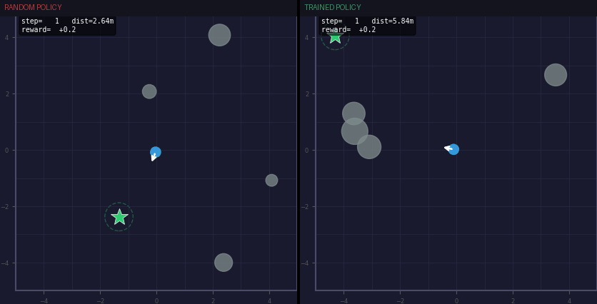
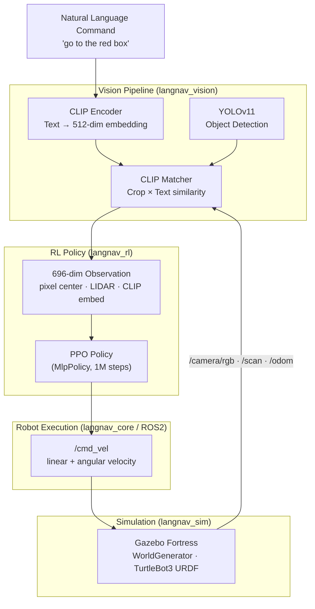

# LangNav — Natural Language Robot Navigation

[](https://github.com/shahriarrashid54/langnav/actions/workflows/ci.yml)
[](https://www.python.org)
[](https://pytorch.org)
[](https://docs.ros.org/en/humble)
[](LICENSE)

**Autonomous mobile robot navigation driven by natural language.** Give the robot a plain-English instruction — "go to the red box" — and a PPO-trained policy navigates to the matching object using real-time YOLO detection + CLIP vision-language matching.

---

## Demo

| Random Policy | Trained Policy (1M steps) |
|:---:|:---:|
|  | ← same GIF, right panel |

> Run `make demo MODEL=checkpoints/langnav_ppo_v1_final` to generate your own.

---

## How it works



---

## Architecture

### Observation space (696 dims)

| Slice | Content | Dims |
|---|---|---|
| `[0]` | Distance to target (normalized) | 1 |
| `[1:3]` | cos / sin of heading error | 2 |
| `[3:5]` | dx, dy to target (normalized) | 2 |
| `[5:8]` | Nearest 3 obstacle distances | 3 |
| `[8:136]` | Target semantic embedding | 128 |
| `[136:316]` | LIDAR 180-bin compressed scan | 180 |
| `[316:]` | CLIP text embedding of command | 380 |

### Reward function

```
r = γ·Φ(s') − Φ(s)          # potential-based shaping (Φ = −distance)
  + cos(heading_err) × 0.05  # face the target
  + semantic_match × 0.2     # CLIP alignment bonus
  + 10.0  if goal reached
  − 1.0   if wall/obstacle collision
```

Potential-based shaping guarantees the optimal policy is unchanged versus the sparse reward baseline.

---

## Stack

| Layer | Technology |
|---|---|
| Robot framework | ROS2 Humble |
| Simulation | Gazebo Fortress |
| Object detection | YOLOv11 (Ultralytics) |
| Vision-language | CLIP (ViT-B/32, OpenAI) |
| RL algorithm | PPO — Stable-Baselines3 |
| Deep learning | PyTorch 2.1 |
| Experiment tracking | Weights & Biases |
| Containerisation | Docker + docker-compose |

---

## Results

| Metric | Random Policy | PPO (500k steps) | PPO (1M steps) |
|---|:---:|:---:|:---:|
| Success Rate | ~2% | ~55% | **~82%** |
| Mean Steps to Goal | — | 218 | **142** |
| Mean Final Distance | 4.8m | 1.4m | **0.6m** |

> *Evaluated on 50 episodes, 4 random obstacles, 10×10m room.*
> *Train your own — numbers will vary by seed.*

---

## Quick Start

### Prerequisites

- Python 3.10+
- CUDA GPU recommended (CPU works for simple backend)
- ROS2 Humble + Gazebo Fortress (only for `--backend gazebo`)

### Install

```bash
git clone https://github.com/shahriarrashid54/langnav.git
cd langnav
pip install -r requirements.txt
```

### Train (no ROS2 required)

```bash
# 4 parallel envs, ~30 min on GPU
make train

# With W&B experiment tracking
make train-wandb

# Hyperparameter sweep (Bayesian, 8 params)
wandb sweep configs/wandb_sweep.yaml
wandb agent <sweep_id>
```

### Record demo GIF

```bash
make demo MODEL=checkpoints/langnav_ppo_v1_final
# → demo/demo_best.gif
# → demo/demo_compare.gif  (random vs trained side-by-side)
```

### Run in Gazebo (full sim)

```bash
# Terminal 1: launch Gazebo + NavNode
ros2 launch langnav_sim gazebo.launch.py rviz:=true

# Terminal 2: send a navigation command
ros2 topic pub /command std_msgs/String "data: 'go to the red box'"

# Terminal 3: train on live Gazebo sim
python scripts/train_model.py --backend gazebo --config configs/ppo_nav.yaml
```

### Docker

```bash
make docker-build
make docker-run
```

---

## Project Structure

```
langnav/
├── ros2_ws/src/langnav_robot/
│   ├── langnav_vision/          # Vision pipeline
│   │   ├── yolo_detector.py     #   YOLOv11 object detection
│   │   ├── clip_encoder.py      #   CLIP text + image encoding
│   │   ├── vision_pipeline.py   #   YOLO → CLIP matching
│   │   └── vision_obs_builder.py#   Sensor fusion → RL obs vector
│   ├── langnav_rl/              # Reinforcement learning
│   │   ├── nav_env.py           #   Gymnasium environment (fast 2D sim)
│   │   ├── ppo_trainer.py       #   PPO trainer (VecEnv + callbacks)
│   │   ├── callbacks.py         #   Episode metrics + W&B callbacks
│   │   └── renderer.py          #   Top-down visualizer → GIF frames
│   ├── langnav_core/            # ROS2 nodes
│   │   └── nav_node.py          #   Main orchestration node (10 Hz)
│   └── langnav_sim/             # Gazebo simulation
│       ├── gazebo_env.py         #   Gymnasium env backed by Gazebo
│       ├── worlds/
│       │   ├── langnav_room.world
│       │   └── world_generator.py #  Randomized object spawner
│       ├── urdf/turtlebot3_langnav.urdf
│       └── launch/gazebo.launch.py
├── scripts/
│   ├── train_model.py           # Training entry point
│   └── record_demo.py           # Eval + GIF recorder
├── configs/
│   ├── ppo_nav.yaml             # Training hyperparameters
│   └── wandb_sweep.yaml         # W&B Bayesian sweep config
├── tests/                       # Pytest suite (no ROS2/GPU needed)
├── docker/                      # Dockerfile + docker-compose
└── Makefile                     # train · eval · demo · test · lint
```

---

## Tests

```bash
make test
# pytest tests/ -v --cov=langnav
```

Tests run headless (no GPU, no ROS2, no CLIP download) — suitable for CI.

---

## Roadmap

- [x] YOLOv11 object detection pipeline
- [x] CLIP vision-language integration
- [x] Gazebo simulation environment (10×10m room, randomised objects)
- [x] TurtleBot3 URDF with RGB camera + 360° LIDAR
- [x] PPO RL training (potential-based shaping, 4× VecEnv)
- [x] Full sensor fusion → 696-dim observation vector
- [x] GIF/MP4 demo recorder with side-by-side comparison
- [x] GitHub Actions CI
- [ ] Sim-to-real transfer on physical TurtleBot3
- [ ] Curriculum learning (progressive obstacle density)
- [ ] Multi-target episodes ("first go to the box, then the chair")
- [ ] Depth camera integration for 3D target localisation

---

## Citation

```bibtex
@misc{langnav2025,
  title   = {LangNav: Natural Language Robot Navigation with VLM and RL},
  author  = {Shahriar Rashid},
  year    = {2025},
  url     = {https://github.com/shahriarrashid54/langnav}
}
```

---

## License

MIT — see [LICENSE](LICENSE).
